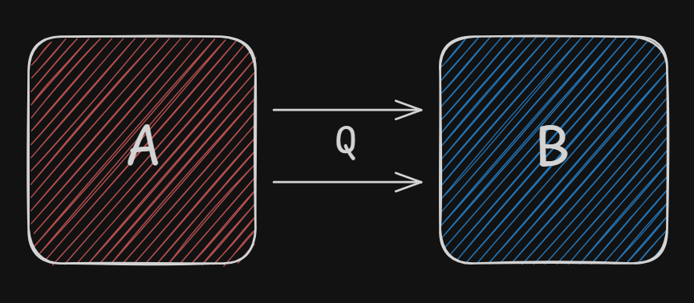

# 🍎 Física

1. Termologia.
2. Óptica geométrica.
3. Ondulatória.

## Semana 1

### Termodinâmica

- Pode possuir uma uma barreira física ou conceitual que permite ou não a troca de energia com a vizinhança.
- Para descrever um sistema, precisamos de **variáveis de estado**, que são:
    - Temperatura; _agitação_
    - Volume; _tamanho_
    - Pressão; _força_
    - Entropia. _organização_ ou _reversível_

#### Temperatura
- Mede o grau de _"agitação"_ em um sistema.
- Está associado a variação da energia interna do sistema.

#### Calor
- É a energia que transita de corpo ao outro.
- Flui espontâneamente do corpo com maior energia até o corpo com menor energia.

 T_{B}" />

#### Equilíbrio Térmico
- Quando dois corpos se encostam e logo ficam com a mesma temperatura.

    

    <h4>Tipos de Sistemas Termodinâmicos</h4>

| Nome | Troca de Energia | Troca de Matéria
| - | :-: | :-: |
| Aberto | 🟩 | 🟩 |
| Fechado | 🟩 | 🟥 |
| Isolado | 🟥 | 🟥 |

#### Escalas Termométricas

| Nome | Ponto de solidificação | Ponto de Ebulição | 
| - | :-: | :-: | 
| Celsius | 0°C | 100°C | 
| Fahrenheit | 32°F | 212°F |
| Kelvin | 273 K | 373 K |

#### Conversão
Representação básica

    

: escala de sua escolha

: Ponto de solidificação

: Diferença entre o ponto de solidificação e o ponto de ebulição

> Depois devemos equilibrar as expressões.

##### Celsius

##### Fahrenheit

##### Kelvin

##### Simplificação

> Equilibrar

> Simplificação (divisão por 10)

> Simplificação (divisão por 2)

#### Exemplos

##### Celsius para Fahrenheit

##### Celsius pra Kelvin

