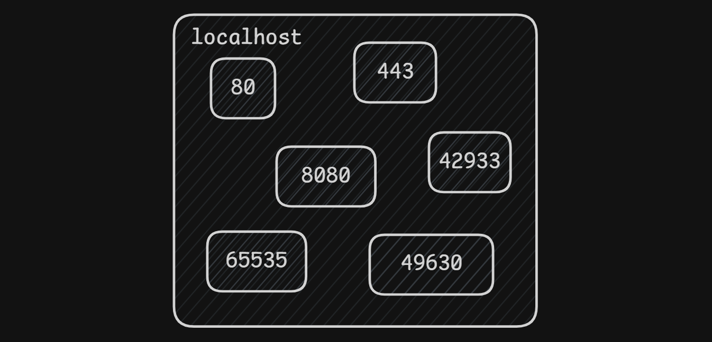
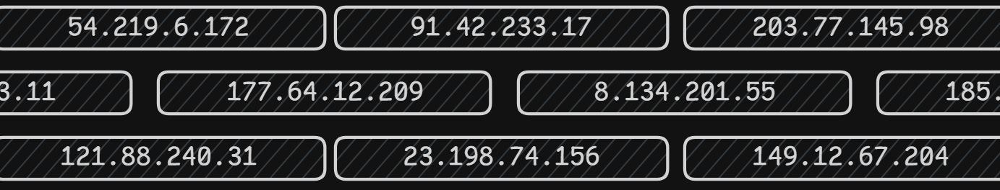

# 🌐 Desenvolvimento de Jogos para Web

1. Desenvolver jogos digitais para web; 
2. Noções de persistência de dados;
3. Implementação de jogos com animações e multimídia em 2D e 3D.

## semana 1

- Antes de um jogos ser desenvolvido, é necessário pensar em um problema e um jeito de deixá-lo divertido.
- A internet é cheia de protocolos, sendo os principais IP, HTTP, HTTPS, ICMP.

- O que é um protocolo?
    - Um conjunto de regras e padrões que definem como as informações são enviadas, recebidas e interpretadas entre dispositivos e sistemas.

- O que é uma porta?
    - O IP é como se fosse um prédio, e a porta é como se fosse um apartamento desse prédio.

- O que é IP(Internet Protocol)?
    - Protocolo que permite a identificação de um dispositivo na rede, como por exemplo: 123.456.7.890 ou 127.0.0.1 (não pode ser 2 endereços iguais).
    - O nosso computador possui um IP que podemos usar pra testes, mas ele só pode ser acessado por você, e o nome dele é `localhost`, que possui o seu valor `127.0.0.1`.

- O que é HTTP(HyperText Transfer Protocol)?
    - Protocolo de comunicação da web usado pra transferir páginas, arquivos, dados entre um navegador e um servidor;  
    _(é o que mostra os sites)_
    - Usado quando tem `http://` no início de uma URL;
    - Usa a porta 80.
        - Mas podemos mudar nas configurações do nosso servidor.

- O que é HTTPS(HyperText Transfer Protocol Secure)?
    - HTTP mas criptografado, sendo mais seguro;
    - Usa a porta 443.
        - Mas podemos mudar nas configurações do nosso servidor.

- O que é ICMP(Internet Control Message Protocol)?
    - Serve pra enviar e receber mensagens de erro;
    - Certifica se a conexão foi bem sucedida.

- O que é ping?
    - É o tempo que leva para enviar e receber uma certificação.
    - Se for 144ms, significa que demorou 72ms pra chegar no servidor, e 72ms pra voltar ao navegador/computador.